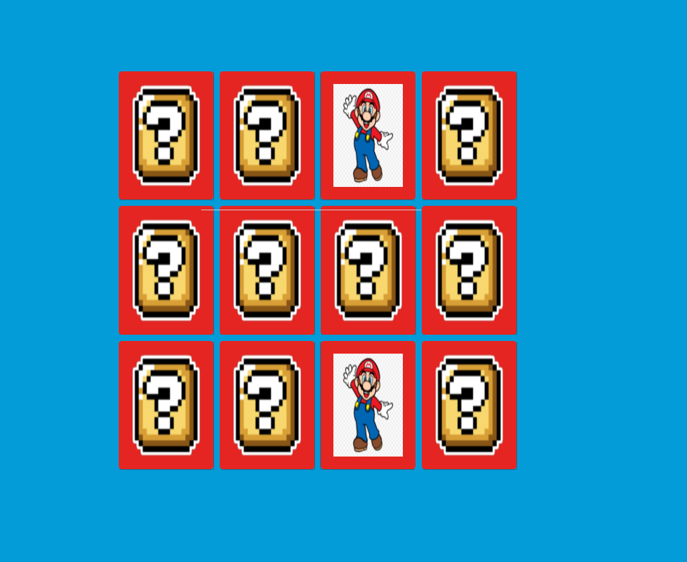

# Desafio de Projeto: Desenvolvendo um Jogo da Memória

Desafio de Projeto do **Bootcamp  TQI Fullstack Developer**, promovido pela [Digital Innovation One](https://www.dio.me).

## Descrição do Desafio

Nesse projeto, o desafio será criar um jogo da memória utilizando apenas HTML, CSS e Javascript. Com poucas linhas de código, aprenderemos juntos a trabalhar com efeitos 3D no CSS e lógica de programação utilizando condicionais, Immediately Invoked Function Expression e manipulação de Array em um projeto super divertido.

**Desafio:** Desenvolvendo um Jogo da Memória com a Temática do Mario Bros

 [Jogue aqui o Jogo da Memória  com a Temática do Mario Bros!](https://ducrz.github.io/Bootcamp-TQI-Fullstack-Developer/Desafios-de-Projeto/DesenvolvendoUmJogoDaMemoria/jogo-da-memoria-dio/index.html)

**Ajustes Feitos:**

* Ajustes de estilo via CSS, com esquema de cores do Mario Bros;
* Inclusão da trilha sonora do Mario Bros do NES, com execução automática.

***Tela do Desafio de Projeto***

