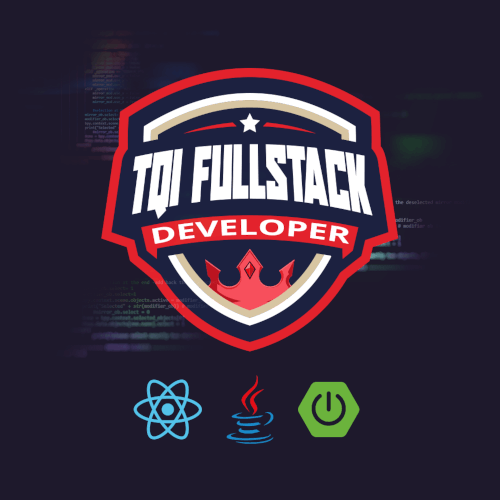

# Bootcamp TQI Fullstack Developer
Códigos e conteúdos do **Bootcamp TQI Fullstack Developer**, promovido pela Digital Innovation One.

O **Bootcamp TQI Fullstack Developer** é um programa gratuito para formação de profissionais que vão atuar em várias partes de um projeto de TI.

Durante a formação será ofertado todo um conjunto de tecnologias que a TQI utiliza para criar as aplicações. O conteúdo foi será aplicado através de aulas remotas com desafios práticos e mentorias.

Os estudantes serão capacitados para lidar, ao mesmo tempo, com o front-end e o back-end de uma aplicação, mesmo que os dois pontos utilizem tecnologias e linguagens diferentes. Além disso, também terão noções de banco de dados e introdução à Quality Assurance (QA) para testes e qualidade.

Os melhores classificados no bootcamp serão selecionados para seguir nas fases seguintes do processo seletivo de contratação.

[Inscrições abertas até dia 27/05!](https://www.dio.me/bootcamp/tqi-fullstack-developer)

